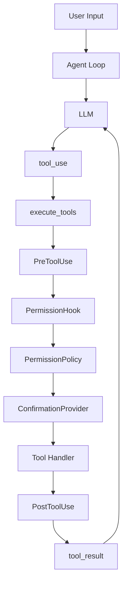

# CodePilot Lite

A lightweight local Coding Agent harness with tool-use loop, workspace-safe file operations, hook-based permissions, interactive confirmation, and policy-driven safety controls.


## Overview

CodePilot Lite is a lightweight local Coding Agent harness inspired by the core idea behind `learn-claude-code` s20: mechanisms are many, loop is one.

It is not a full Claude Code clone. The project focuses on growing from the smallest useful tool-use loop into a safe, testable, and extensible local Agent harness. The LLM reasons and chooses tools; the Python harness owns tool registration, dispatch, workspace boundaries, permission checks, confirmation, and tool-result feedback.

The core loop is intentionally small:

```python
while True:
    response = LLM(messages, tools)

    if not has_tool_use(response):
        return response

    tool_results = execute_tools(response)
    messages.append(tool_results)
```

## Features

### Phase 1: Minimal Tool-use Loop

- LLM tool-use loop
- Message management
- `read_file`
- `list_dir`
- `run_command`
- Workspace-safe path resolution
- Pytest coverage

### Phase 2: File Write and Edit Tools

- `write_file`
- `edit_file`
- Parent directory creation
- Workspace boundary checks

### Phase 3: Hook and Permission System

- `HookEvent`
- `HookResult`
- `HookManager`
- `PreToolUse`
- `PostToolUse`
- `PermissionHook`
- `LoggingHook`

### Phase 4: Interactive Confirmation

- `ConfirmationProvider`
- `CliConfirmationProvider`
- `AutoApproveConfirmationProvider`
- `AutoDenyConfirmationProvider`
- Confirmation flow for `write_file`, `edit_file`, and `run_command`

### Phase 5: Policy-based Permission System

- `PermissionPolicy`
- `PermissionDecision`
- `allow` / `ask` / `deny`
- Path policy
- Command policy
- `--permission-policy` CLI option
- Default fallback policy

## Architecture



## Permission Flow

Current tool execution flow:

```text
tool_use
-> PreToolUse
-> PermissionHook
-> PermissionPolicy allow / ask / deny
-> ask: ConfirmationProvider
-> execute handler
-> PostToolUse
-> tool_result
```

Default behavior:

- `read_file` and `list_dir` are allowed by default.
- `write_file`, `edit_file`, and `run_command` ask for confirmation by default.
- Dangerous commands are denied by default.
- Paths outside the workspace are rejected.
- Sensitive paths such as `.env` and `secrets/*` can be denied through policy.

## Quick Start

```powershell
git clone https://github.com/ink-charon/codepilot_lite.git
cd codepilot_lite
python -m venv .venv
.venv\Scripts\activate
pip install -r requirements.txt
copy .env.example .env
python -m my_agent.main --workspace .
```

Do not commit a real `.env` file. Use `.env.example` as the template for local configuration.

## Configuration

Environment variables:

```env
LLM_API_KEY=
LLM_BASE_URL=
LLM_MODEL=
AGENT_MAX_TURNS=10
LLM_RETRIES=2
COMMAND_TIMEOUT_SECONDS=30
MAX_COMMAND_OUTPUT_CHARS=12000
```

Run with an explicit permission policy:

```powershell
python -m my_agent.main --workspace . --permission-policy config/permissions.example.yaml
```

Example policy:

```yaml
permissions:
  tools:
    read_file: allow
    list_dir: allow
    write_file: ask
    edit_file: ask
    run_command: ask

  paths:
    ".env": deny
    "secrets/*": deny
    "README.md": ask

  commands:
    allow:
      - "python --version"
      - "python -m pytest"
      - "git status"
    ask:
      - "git add"
      - "git commit"
      - "git push"
    deny:
      - "rm -rf /"
      - "rm -rf *"
      - "shutdown"
      - "reboot"
```

## Testing

```powershell
python -m pytest --basetemp=.pytest_tmp
```

Current result:

```text
43 passed
```

On Windows, if `.pytest_tmp` has a local permission issue, remove it and rerun:

```cmd
rmdir /s /q .pytest_tmp
python -m pytest --basetemp=.pytest_tmp
```

## Project Structure

```text
my_agent/
  agent/        Agent loop, message handling, and system prompt.
  hooks/        Hook primitives, permission hook, and logging hook.
  llm/          OpenAI-compatible LLM client.
  permission/   Interactive confirmation providers.
  policy/       Policy model and policy loader.
  tools/        Tool definitions, handlers, registry, and dispatcher.
  workspace/    Workspace root and safe path resolution.
config/         Example permission policy files.
tests/          Pytest coverage for each project phase.
docs/           Design notes and project documentation.
```

## Roadmap

- Audit logging and permission observability
- Better command policy matching
- Todo manager
- Context compaction
- Skill loading
- MCP integration as future work
- Multi-agent task graph as future work
- Worktree isolation

## Design Philosophy

- Mechanisms are many, loop is one.
- LLM decides, harness executes.
- Safety belongs to the harness.
- Tools are separated into definitions and handlers.
- Permissions are policy-driven and testable.
