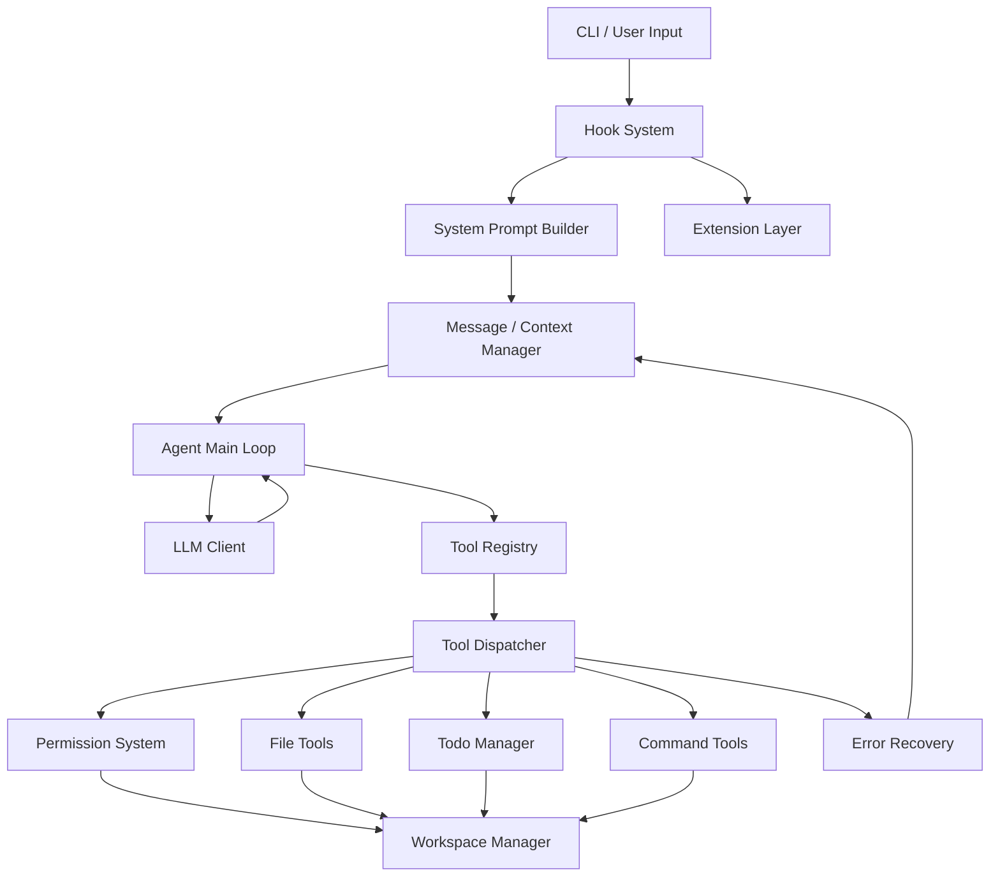

# 本地 Coding Agent 软件设计文档（SDD）

## 1. 项目概述

本项目是一个运行在本地项目目录中的 Coding Agent。它不是普通聊天机器人，而是一个 Agent Harness：LLM 负责理解用户任务、规划下一步、选择工具并生成工具参数；Python Harness 负责维护上下文、注册和分发工具、执行权限检查、限制 workspace 边界、捕获错误，并将工具执行结果回传给模型。

项目参考 `learn-claude-code s20_comprehensive` 的主循环思想，即“机制很多，循环一个”。第一阶段只实现最小可运行闭环，不直接复制任何外部源码，不引入 MCP、multi-agent、cron、background task 等高级机制。

## 2. 设计目标

- 最小闭环优先：优先完成“用户输入 -> LLM -> 工具调用 -> tool_result 回传 -> 最终回答”。
- 主循环清晰：所有能力挂载在同一个 Agent loop 中。
- 工具系统可扩展：工具定义与工具 handler 分离。
- 权限控制可插拔：权限检查由 Harness 控制，可通过 hook 扩展。
- workspace 边界安全：所有文件路径必须经过统一 resolve。
- messages 结构清晰：system、user、assistant、tool_result 各司其职。
- system prompt 可动态组装：根据 workspace、工具和运行策略生成。
- 工具执行结果可回传模型：模型必须看到工具结果后继续推理。
- 后续可扩展 memory、skills、MCP、multi-agent、cron、background task。

## 3. 总体架构



架构分层如下：

- CLI / User Input 层：接收任务、workspace、模型参数。
- Agent Main Loop 层：驱动 LLM 调用、tool_use 检测、工具执行和最终输出。
- LLM Client 层：封装模型 API，屏蔽供应商差异。
- Message / Context 管理层：维护短期上下文。
- System Prompt 组装层：动态构造 system prompt。
- Tool Registry 层：向 LLM 暴露工具定义，向 Harness 暴露 handler。
- Tool Dispatcher 层：提取 tool_use、权限检查、调用 handler、构造 tool_result。
- Hook System 层：在关键生命周期节点插入扩展逻辑。
- Permission System 层：由 Harness 执行安全策略。
- Workspace Manager 层：统一路径解析和边界控制。
- Todo Manager 层：维护轻量任务状态。
- Error Recovery 层：捕获 LLM 和工具错误，避免 Agent 崩溃。
- Extension 层：为后续 memory、skills、MCP 等预留扩展点。

## 4. Agent 主循环设计

主循环流程：

```text
用户输入
  -> UserPromptSubmit Hook
  -> 组装 system prompt
  -> 组装 tools
  -> 调用 LLM
  -> 检查 assistant message 是否包含 tool_use
      否 -> 触发 Stop Hook -> 返回最终回答
      是 -> 遍历 tool_use
          -> PreToolUse Hook
          -> Permission Check
          -> Execute Tool
          -> PostToolUse Hook
          -> tool_result 加回 messages
          -> 进入下一轮
```

Python 风格伪代码：

```python
def run_agent(user_input: str) -> str:
    hook_manager.emit("UserPromptSubmit", {"prompt": user_input})
    messages = [
        build_system_message(workspace, tools),
        {"role": "user", "content": user_input},
    ]

    for turn in range(max_turns):
        response = llm.complete(messages=messages, tools=tool_registry.definitions())
        messages.append(response.message)

        tool_uses = extract_tool_uses(response.message)
        if not tool_uses:
            hook_manager.emit("Stop", {"message": response.message})
            return extract_text(response.message)

        tool_results = execute_tools(tool_uses)
        messages.extend(tool_results)

    return "已达到最大循环次数，任务未完全结束。"
```

## 5. Message 结构设计

- system message：定义 Agent 身份、边界、工具使用原则、安全规则和输出风格。
- user message：保存用户任务和补充指令。
- assistant message：保存模型推理后产生的自然语言内容或 tool_use。
- tool_use block：由模型生成，描述工具名、调用 id 和参数。
- tool_result block：由 Harness 生成，描述工具调用结果、错误或权限拒绝。

`messages` 是 Agent 的短期上下文，因为每一轮 LLM 调用都依赖之前的用户意图、assistant 决策和工具结果。工具执行后必须把 `tool_result` 回传给模型，否则模型不知道外部世界发生了什么，无法基于真实文件内容、命令输出或错误继续推理。只执行工具但不告诉模型结果，会让 Agent 进入“模型以为自己完成了操作，但没有证据”的不一致状态。

## 6. Tool 系统设计

第一阶段工具表：

| 工具名 | 功能 | 输入参数 | 返回结果 | 安全风险 | 默认权限 |
| --- | --- | --- | --- | --- | --- |
| `read_file` | 读取 workspace 内文本文件 | `path` | 文件内容或错误 | 越界读取、敏感文件泄露 | 允许 |
| `list_dir` | 列出 workspace 内目录 | `path` | 目录条目 | 越界枚举 | 允许 |
| `write_file` | 写入或创建文件 | `path`, `content` | 写入结果 | 覆盖文件、越界写入 | 确认 |
| `edit_file` | 基于字符串替换编辑文件 | `path`, `old`, `new` | 编辑结果 | 误替换、覆盖关键代码 | 确认 |
| `run_command` | 在 workspace 中执行命令 | `command`, `timeout_seconds` | stdout、stderr、exit_code | 破坏性命令、长时间运行 | 确认 |
| `todo_write` | 写入 todo 列表 | `items` | 保存结果 | 目标漂移、错误计划固化 | 确认 |
| `todo_read` | 读取 todo 列表 | 无 | todo 列表 | 低风险 | 允许 |

工具分为两部分：

```python
TOOL_DEFINITIONS = [...]
TOOL_HANDLERS = {
    "read_file": handle_read_file,
    "write_file": handle_write_file,
}
```

工具定义给 LLM 看，用于说明工具名称、描述和 JSON 参数 schema。handler 给 Harness 执行，用于真正操作文件、命令和状态。两者不能混在一起，因为 LLM 只能选择工具和生成参数，不能获得或执行 Python 函数本身；Harness 必须保留实际执行权和安全控制权。

## 7. Tool Dispatch 设计

```python
def execute_tools(tool_uses: list[ToolUse]) -> list[Message]:
    results = []
    for tool_use in tool_uses:
        try:
            handler = registry.get_handler(tool_use.name)
            hook_manager.emit("PreToolUse", {"tool_use": tool_use})
            permission.check(tool_use)
            output = handler(tool_use.input)
            status = "ok"
        except Exception as exc:
            output = summarize_exception(exc)
            status = "error"
        finally:
            hook_manager.emit("PostToolUse", {"tool_use": tool_use, "status": status})

        results.append({
            "role": "tool",
            "tool_call_id": tool_use.id,
            "content": json.dumps({"status": status, "output": output}, ensure_ascii=False),
        })
    return results
```

职责包括：提取 tool_use block、查找 handler、触发 hook、执行权限检查、调用工具函数、捕获异常、构造 tool_result，并返回给主循环。

## 8. Hook 系统设计

- UserPromptSubmit：用户输入后、进入 LLM 前触发，可用于日志、审计、输入归一化。
- PreToolUse：工具执行前触发，可用于权限检查、危险操作拦截、审计。
- PostToolUse：工具执行后触发，可用于统计工具输出、记录失败原因。
- Stop：本轮没有 tool_use、准备返回最终答案时触发，可用于最终日志、输出整理。

Hook 可以承载日志记录、权限检查、审计、工具输出统计、危险操作拦截和后续插件扩展。根据 s20 架构思想推断，hook 应保持轻量同步接口，避免第一阶段引入后台任务复杂度。

## 9. Permission System 设计

第一阶段默认允许：

```text
read_file
list_dir
todo_read
```

默认需要确认：

```text
write_file
edit_file
run_command
todo_write
```

默认阻止：

```text
rm -rf /
del /s /q C:\
format
shutdown
reboot
写入 workspace 外部路径
读取明显越界路径
```

权限必须由 Harness 控制，不能完全相信 LLM。所有路径必须经过 `WorkspaceManager.resolve_path()`，所有命令必须经过危险命令检测。权限系统应挂在 `PreToolUse` hook 或工具执行前；第一阶段采用工具执行前的显式 `permission.check()`，hook 负责记录和扩展。

## 10. Workspace 设计

用户启动 Agent 时指定 workspace。Agent 只能在 workspace 内操作文件；相对路径都基于 workspace；所有路径 resolve 成绝对路径；禁止通过 `../` 越界；写入文件前检查父目录存在且仍在 workspace 内；后续可扩展 worktree 隔离。

核心接口：

```python
class WorkspaceManager:
    def resolve_path(self, path: str) -> Path:
        ...

    def ensure_inside_workspace(self, path: Path) -> None:
        ...

    def read_text(self, path: str) -> str:
        ...

    def write_text(self, path: str, content: str) -> None:
        ...
```

## 11. Todo 设计

```python
@dataclass
class TodoItem:
    id: str
    content: str
    status: Literal["pending", "in_progress", "done"]
    created_at: str
    updated_at: str
```

Todo 帮助 Agent 处理长任务，防止开发过程中目标漂移，让用户看到当前计划，并为后续 task graph 做准备。第一阶段通过 `todo_write` 和 `todo_read` 写入 workspace 内的 `.my_agent/todos.json`。

## 12. System Prompt 设计

可直接使用的 system prompt：

```text
你是一个本地 Coding Agent，运行在用户指定的 workspace 中。你不是普通聊天机器人，而是通过工具协助用户完成代码开发任务的 Agent Harness 使用者。

工作边界：
- 只能基于用户任务和工具返回结果行动。
- 文件读写必须限制在 workspace 内。
- 不要声称已经读取、写入或执行命令，除非你确实调用了对应工具并收到成功结果。

工具使用原则：
- 需要了解项目结构时，先使用 list_dir 或 read_file。
- 需要修改文件时，优先读取相关文件，再调用 write_file 或 edit_file。
- 工具失败后，根据错误信息调整下一步，不要重复相同失败调用。
- 不要调用与任务无关的工具。

文件操作原则：
- 所有路径使用相对 workspace 的路径。
- 修改前理解上下文，避免无关重构。
- edit_file 只能用于明确、唯一的文本替换；复杂修改应使用 write_file 写入完整内容。

命令执行原则：
- run_command 只用于必要的测试、检查、格式化或项目脚本。
- 不要请求执行破坏性命令。
- 命令超时或失败时，阅读错误并给出下一步。

todo 使用原则：
- 多步骤开发任务应使用 todo_write 记录计划。
- 每完成一个重要阶段，更新 todo 状态。
- 简单问答不需要 todo。

安全规则：
- 不要尝试越过 workspace 边界。
- 不要请求删除根目录、格式化磁盘、关机、重启或执行明显破坏性命令。
- 如果权限被拒绝，说明原因并选择安全替代方案。

输出风格：
- 使用简洁、明确的中文。
- 最终回答说明完成内容、验证结果和未完成风险。

错误处理：
- 工具返回错误时，将错误视为事实依据继续推理。
- 无法完成时，明确说明阻塞原因和需要用户提供的信息。
```

## 13. Error Recovery 设计

第一阶段错误恢复策略：

- LLM API 调用失败时进行有限重试。
- 工具不存在时返回错误 `tool_result`。
- 工具参数错误时返回错误 `tool_result`。
- 文件不存在时返回明确错误。
- 命令超时时终止并返回 timeout 信息。
- 工具执行异常时捕获 traceback 摘要。
- 单个工具失败不导致整个 Agent 崩溃。

后续可扩展 429 指数退避、529 重试、fallback model、prompt too long compact、max_tokens continuation 和 tool_result 压缩。

## 14. 目录结构设计

```text
my_agent/
  main.py
  config/
    settings.py
  agent/
    loop.py
    messages.py
    prompt.py
  llm/
    client.py
  tools/
    registry.py
    dispatcher.py
    file_tools.py
    command_tools.py
    todo_tools.py
  hooks/
    base.py
    permission.py
    logging.py
  workspace/
    manager.py
  tests/
    test_workspace.py
    test_tools.py
```

- `main.py`：CLI 入口。
- `config/settings.py`：运行配置、模型配置、超时配置。
- `agent/loop.py`：Agent 主循环。
- `agent/messages.py`：消息和 tool_use 数据结构。
- `agent/prompt.py`：system prompt 组装。
- `llm/client.py`：LLM API 封装。
- `tools/registry.py`：工具定义和 handler 注册。
- `tools/dispatcher.py`：工具分发、错误捕获、tool_result 构造。
- `tools/file_tools.py`：文件读取、写入、编辑、目录枚举。
- `tools/command_tools.py`：命令执行与输出截断。
- `tools/todo_tools.py`：todo 持久化。
- `hooks/base.py`：hook 基础接口和管理器。
- `hooks/permission.py`：权限策略。
- `hooks/logging.py`：基础日志 hook。
- `workspace/manager.py`：workspace 路径边界控制。
- `tests/`：基础单元测试。

## 15. 第一阶段实现路线

### Phase 1：最小 Agent 主循环

实现 CLI 输入、messages 管理、LLM 调用、tool_use 检测、tool_result 回传、`read_file`、`list_dir`。

### Phase 2：命令执行

实现 `run_command`、命令超时、命令输出截断、危险命令拦截。

### Phase 3：文件写入

实现 `write_file`、`edit_file`、workspace 边界检查、写入前确认。

### Phase 4：Hook 和 Permission

实现 `UserPromptSubmit`、`PreToolUse`、`PostToolUse`、`Stop` 和 permission hook。

### Phase 5：Todo

实现 `todo_write`、`todo_read` 和 `.my_agent/todos.json` 持久化。

### Phase 6：工程化

实现配置文件、日志、单元测试、错误恢复和 README。

### Phase 7：参考 s20 扩展

后续再考虑 memory、skills、compact、background task、cron、MCP、multi-agent、worktree。

## 16. 核心代码骨架

核心代码骨架位于 `my_agent/`，体现主循环、工具注册、工具分发、tool_result 回传、workspace 安全边界和 permission hook。第一阶段不要求一次性实现所有高级能力。

## 17. 实现约束

1. 不直接复制 learn-claude-code 的源码。
2. 只参考 s20 的架构思想。
3. 第一阶段只做最小闭环。
4. 不实现 MCP、multi-agent、cron、background task。
5. 危险操作必须由 Harness 层拦截。
6. 工具定义和工具 handler 必须分离。
7. 所有文件路径必须受 workspace 限制。
8. 工具执行失败不能导致整个 Agent 崩溃。
9. 不确定的实现细节标注“根据 s20 架构思想推断”。
